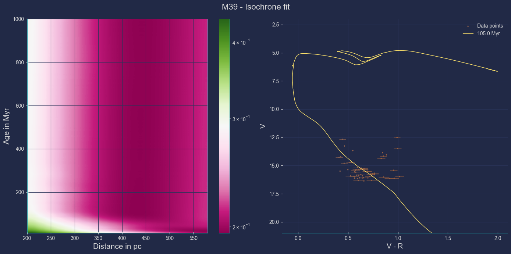
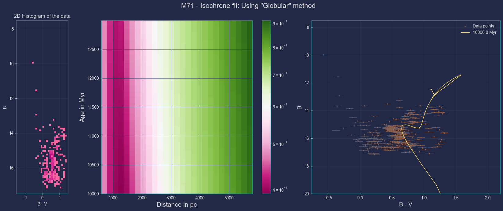

# Lab_Astro_2023
Astrophysics laboratory repo. Project: stellar cluster analysis, using **stellar isochrone** models, to determine their age/distance from Earth.

**M39** H-R Diagram + Isochrone Fitting:

**M71** H-R Diagram + Isochrone Fitting:

Note: The most recent code (and the one that should be used!) is inside the folder `Clean-up`.
